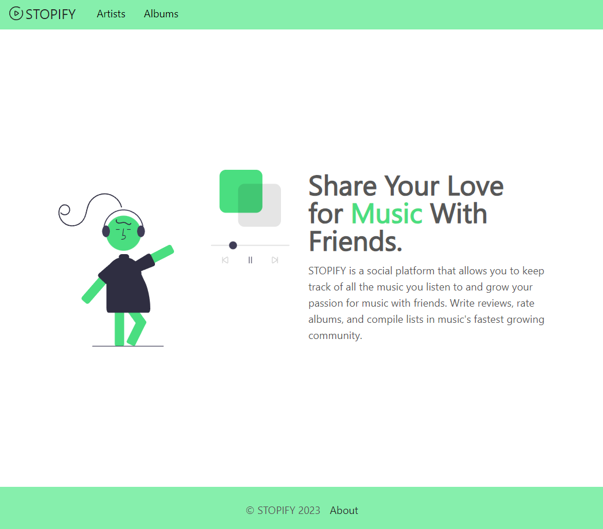

# STOPIFY

Project in Action - [STOPIFY](https://stopify-next12.vercel.app/)

## Music discography platform

The application was written in the Next.js framework.
TailwindCSS was used for styling.
A library with ready-made components (Rsuite) was also used.

